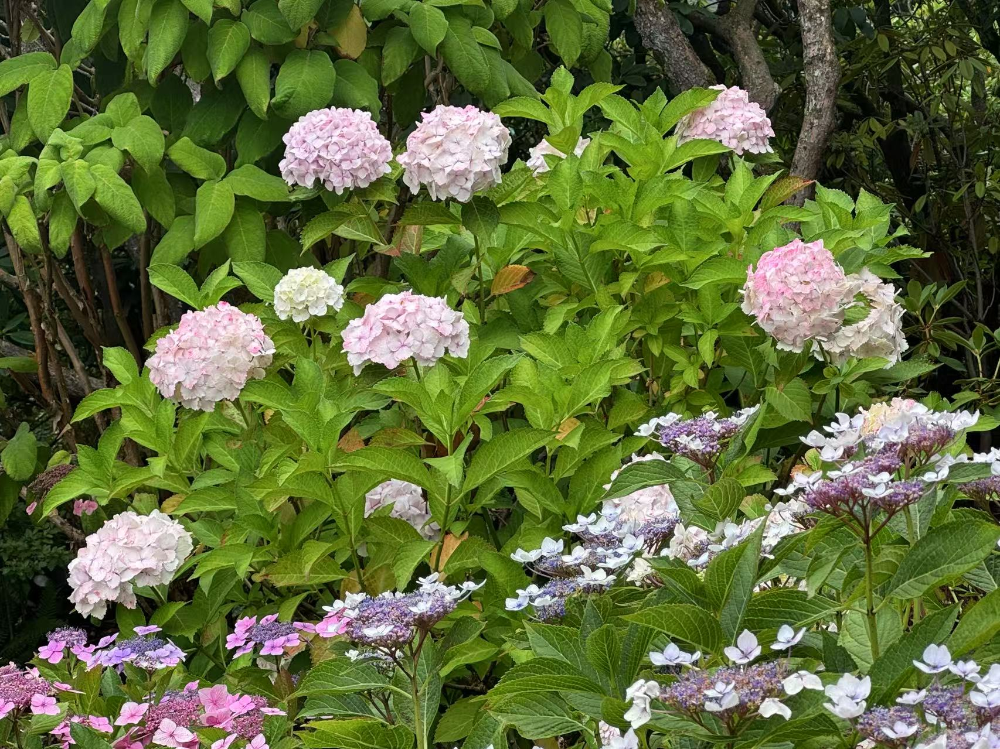
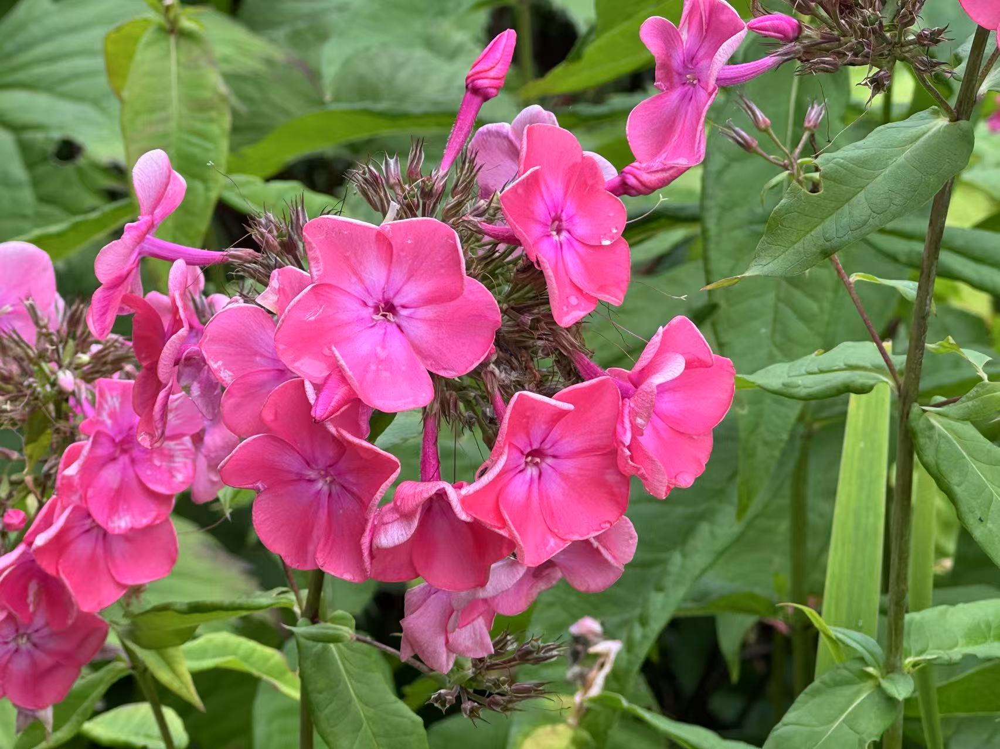
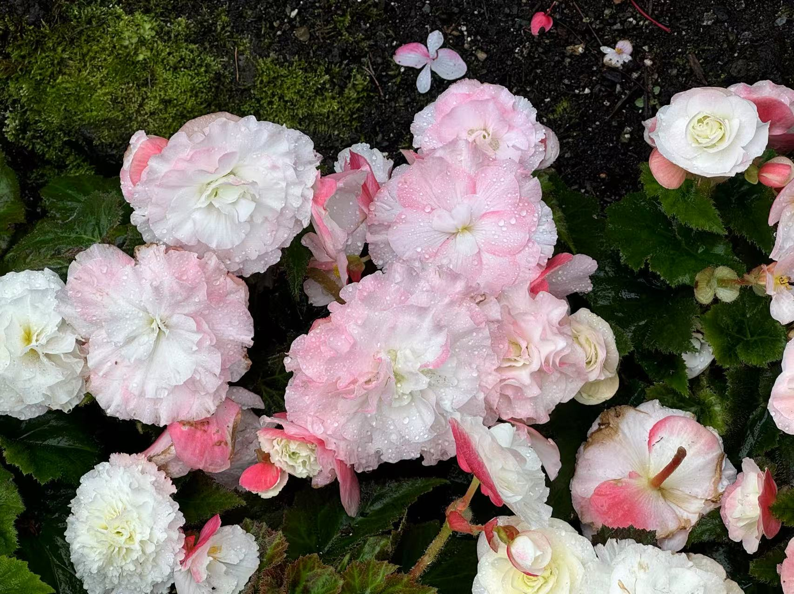
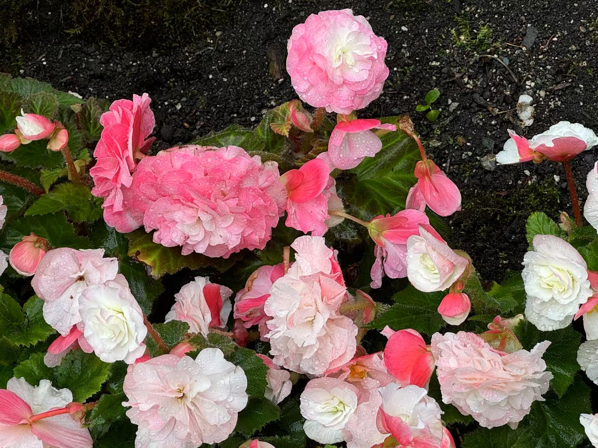
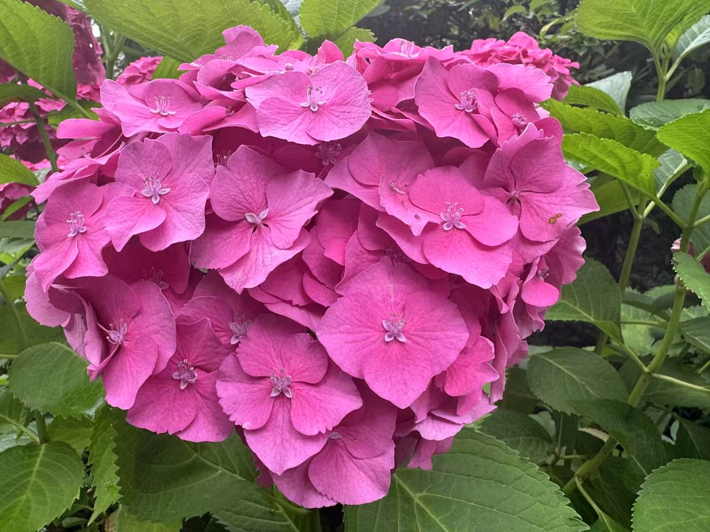
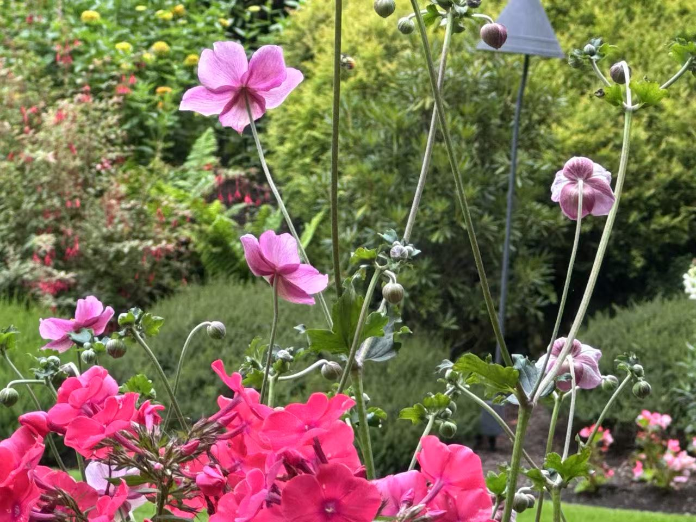

<!-- 放一些杂项 -->

---

# 💾Links

- USTC: [en.ustc.edu.cn](https://en.ustc.edu.cn){:target="_blank"} 
- ECE, USTC: [en.sist.ustc.edu.cn](https://en.sist.ustc.edu.cn/2011/0520/c4923a44383/page.psp){:target="_blank"} 
- iCourse Club, USTC: [icourse.club](https://icourse.club){:target="_blank"} 
- AcademicPages (template for this website): [academicpages](https://github.com/academicpages/){:target="_blank"} 

# 📷Photos of Flowers

    
    
    
    
     
    
    
    
    
    

        Flowers in the <a href = "https://www.butchartgardens.com/">Butchart Gadrens</a>, Brentwood Bay, BC V8M 1A6, Canada, 08/14/2024 (photos taken by myself) 
    

    
 

---

