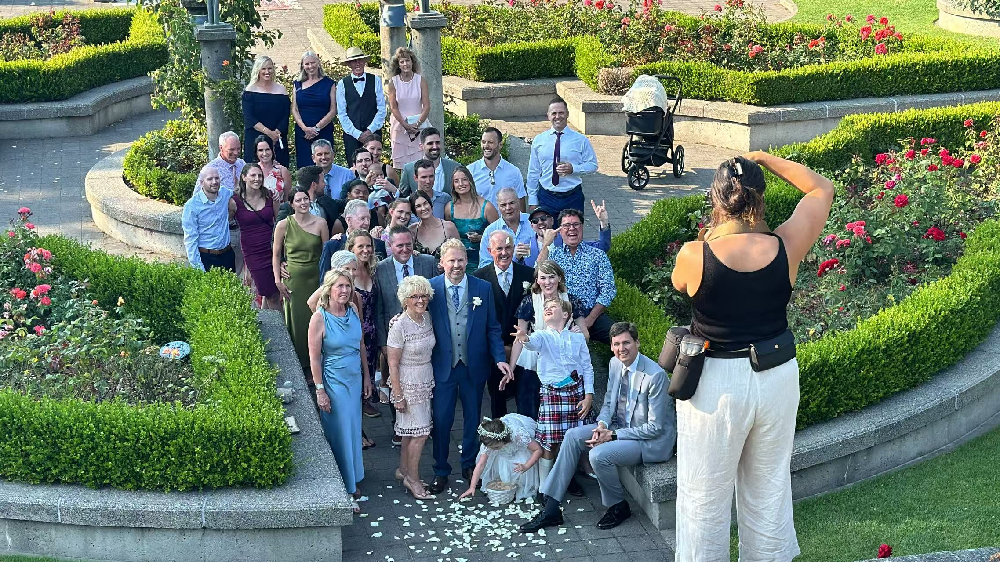

<!-- 如果要设置图片大小什么的，尽量去设置宽度而不是高度，因为你设置的高度会被CSS的 height: auto 覆盖掉；但是设置 width=60% 会导致编译失败，一定要写 width="60%" -->

---

# Photos 

    
     
    

        Sunken Garden in the <a href = "https://www.butchartgardens.com/">Butchart Gadrens</a>, Brentwood Bay, BC V8M 1A6, Canada, 08/14/2024
    

    
 

    
     
    

        Ecomarine English Bay at the <a href = "https://granvilleisland.com/"> Granville Island</a>, 1700 Beach Ave, Vancouver, BC V6G, Canada, 08/11/2024
    

    
 

    
     
    

        Wedding at the <a href = "https://visit.ubc.ca/see-and-do/gardens-and-nature/ubc-rose-garden"> UBC Rose Garden</a>, 6200 University Blvd Vancouver, BC Canada V6T 1Z4, Canada, 08/10/2024
    

    
 

    
     
    

        Visit Pyramids of Giza, Egypt when transfering from Cairo to Toronto
    

    
 

    
     
    

        my bicycle at the riverside in Thirty-Peak agricultural region, Hefei, March 2022
    

    
 

    
     
    

        USTC cycling club
    

    
 

    
     
    

        my aerobike at the school gate
    

    
 

    
     
    

        at the Sanhe Ancient Town, Nov. 2022
    

    
 

    
    
     
    
    
     
    

        riding by the Chaohu Lake at a local club event, Mar. 2023
    

    
 

    
    
     
    

        local cycling club event (100+ participants), Aug. 2023
    

    
 

    
    
     
    
    
     
    

        tour of the Thousand Island Lake (5000+ participants), Jun. 2024
    

    
 

