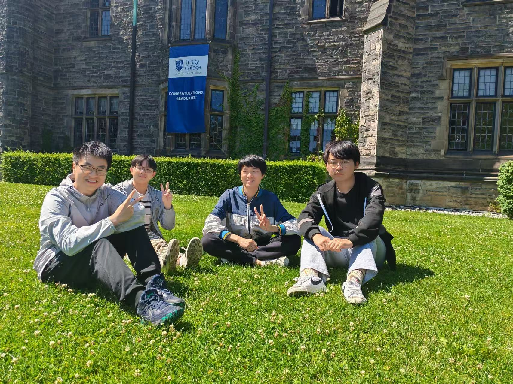
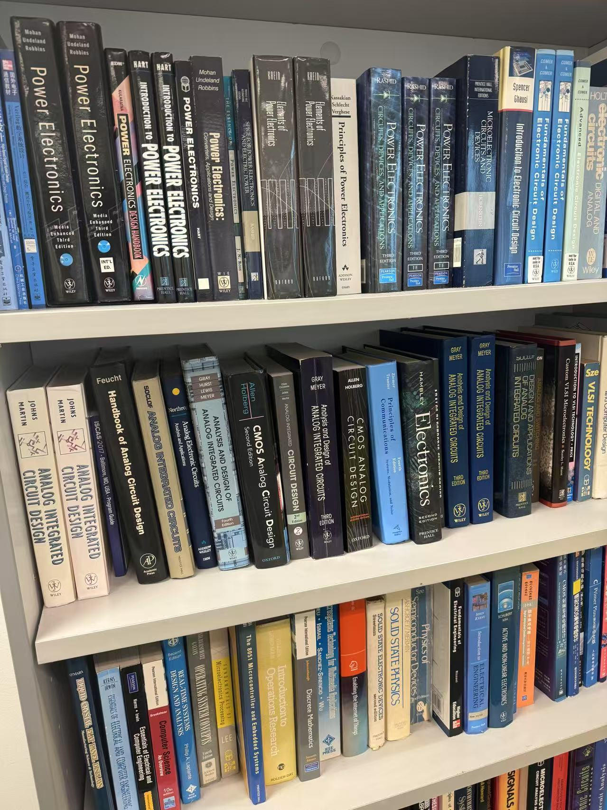
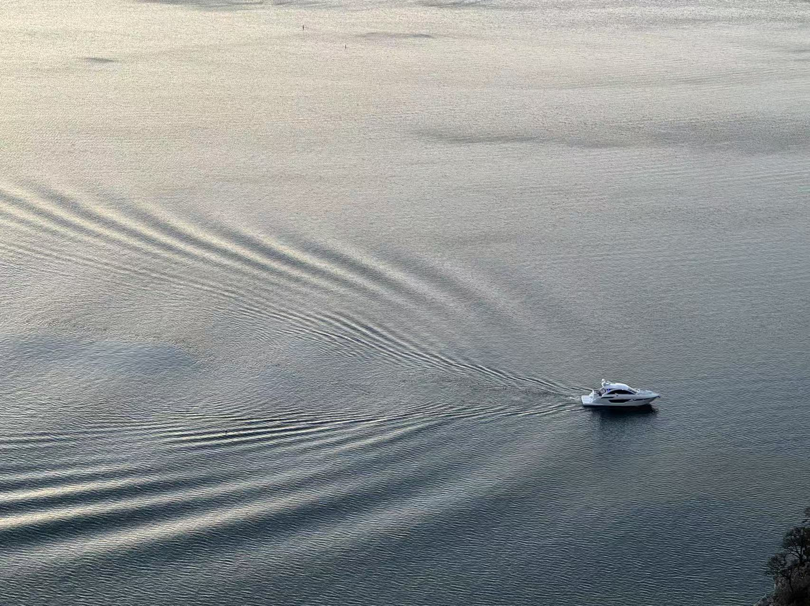
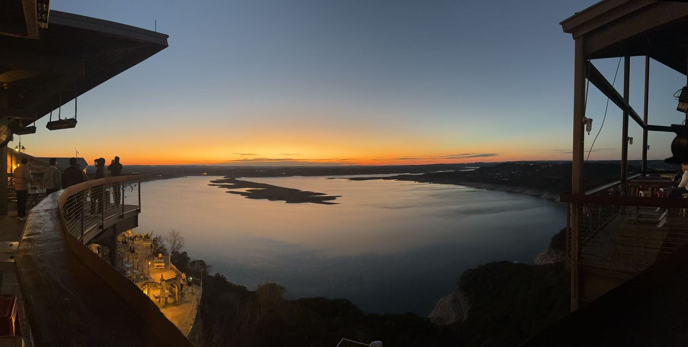
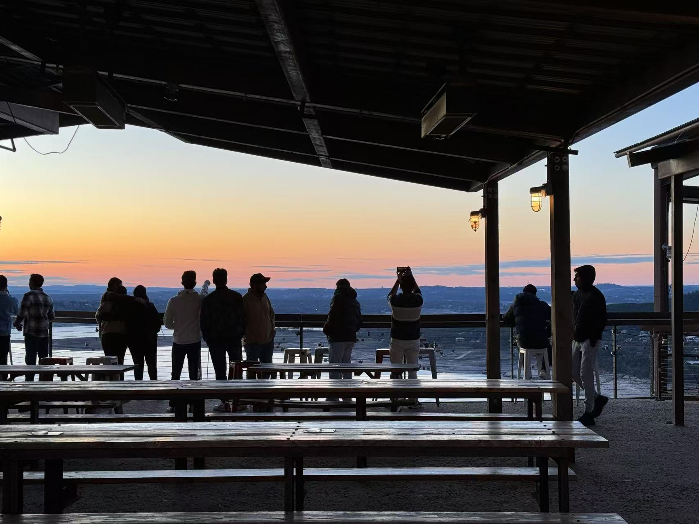

<!-- 如果要设置图片大小什么的，尽量去设置宽度而不是高度，因为你设置的高度会被CSS的 height: auto 覆盖掉；但是设置 width=60% 会导致编译失败，一定要写 width="60%" -->

---

# Photos 

    
     
    

        Sunken Garden in the <a href = "https://www.butchartgardens.com/">Butchart Gadrens</a>, Brentwood Bay, BC V8M 1A6, Canada, 08/14/2024
    

    
 

    
     
    

        Ecomarine English Bay at the <a href = "https://granvilleisland.com/"> Granville Island</a>, 1700 Beach Ave, Vancouver, BC V6G, Canada, 08/11/2024
    

    
 

    
     
    

        Wedding at the <a href = "https://visit.ubc.ca/see-and-do/gardens-and-nature/ubc-rose-garden"> UBC Rose Garden</a>, 6200 University Blvd Vancouver, BC Canada V6T 1Z4, Canada, 08/10/2024
    

    
 

    
     
    

        Visited <a href = "https://www.trinity.utoronto.ca/">Trinity College in the University of Toronto</a> at 6 Hoskin Avenue, Toronto, Ontario, Canada M5S 1H8, with friends when doing summer research in <a href = "https://www.mcmaster.ca/"> McMaster University</a>, 07/01/2024
    

    
 

    
     
    

        Visited Pyramids of Giza, Egypt when transfering from Cairo to Toronto, 06/28/2024
    

    
 

    
     
    

        Watched <a href = "https://uk.thephantomoftheopera.com/"> The Phantom of the Opera</a> at His Majesty's Theatre, 57 Haymarket, London, SW1Y 4QL, United Kingdom, 08/12/2023 
    

    
 

    
     
    

        Visited <a href = "https://www.kings.cam.ac.uk/"> King's College, Cambridge</a> CB2 1ST, UK with friends when paticipating in Summer Institute at <a href = "https://www.oriel.ox.ac.uk/"> Oriel College of Oxford University</a>, 08/06/2023 
    

    
 

    
     
    

        Visited <a href = "https://fengbintu.github.io/">Prof. Fengbin Tu</a>'s Lab at <a href = "https://hkust.edu.hk/">The Hong Kong University of Science and Technology, Clear Water Bay, Kowloon, Hong Kong, under the guidance of my senior <a href = "https://starkerfirst.github.io/">Bohan Yang </a>, 04/06/2024
    

    
 

    
    
     
    
    
     
    

        riding by the Chaohu Lake at a local club event, Mar. 2023
    

    
 

    
    
     
    

        local cycling club event (100+ participants), Aug. 2023
    

    
 

    
    
     
   
    

    

     
    

        Watch the sunset at <a href = "https://www.oasis-austin.com/">The Oasis on Lake Travis</a>, 6550 Comanche Trail Austin TX, 78732, 02/17/2024
    

    
 

